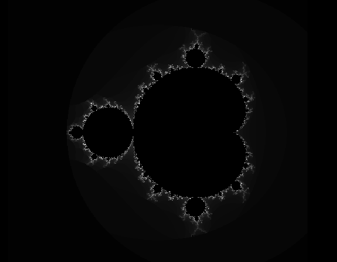
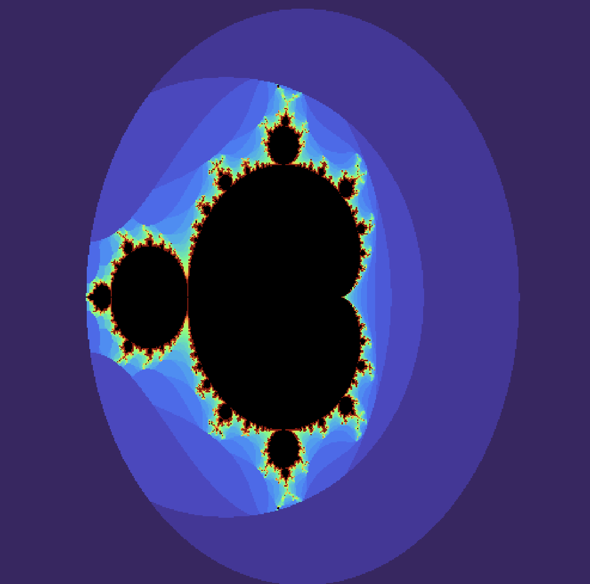

As you may notice, this maximal score for this evaluation is 25/20. That means you can skip some exercices if you want. 

You can join the discord room about this [exams here](https://discord.gg/3K53C9NH) to ask questions.

Please, write nice code well commented and tested (3 pts)

# Questions and Answers (2pts) :

1. What kind of behaviour a program written in rust can't have ?

Answer here ... and commit

# Practical exercices : 

These exercices are related to image processing in rust.
We will use the crate ```image_show``` to display image on screen and the crate ```image``` to manipulate pixels in image.
We will only work with RGB Images (the image crate allow to use a lot of ) 

# Exerice 1 : Chess board drawer (7 points)

1. From the project here, add the create ```text_io``` and ask the user to enter a integer number. We call this number ```cell_count``` (1pt)
2. Create a method that draw a square chessboard with dimensions : ```cell_count x cell_count``` with cells colors altering black and white. (3pt)
3. Write a unit test for the method you created in the previous question (3pt).


# Exercice 2 Mandelbrot set (13 points): 

[Mandelbrot set](https://en.wikipedia.org/wiki/Mandelbrot_set), before being a very complex mathematical object, is very nice !
Drawing the Mandelbrot set consist in implementing an escaping algorithm. That means testing convergence of a numerical series. We will implement the naïve esacaping algorithm [decribed here](https://en.wikipedia.org/wiki/Plotting_algorithms_for_the_Mandelbrot_set), and recalled here in pseudocode : 
```
for each pixel (Px, Py) on the screen do
    x0 := scaled x coordinate of pixel (scaled to lie in the Mandelbrot X scale (-2.00, 0.47))
    y0 := scaled y coordinate of pixel (scaled to lie in the Mandelbrot Y scale (-1.12, 1.12))
    x := 0.0
    y := 0.0
    iteration := 0
    max_iteration := 100
    while (x*x + y*y ≤ 2*2 AND iteration < max_iteration) do
        xtemp := x*x - y*y + x0
        y := 2*x*y + y0
        x := xtemp
        iteration := iteration + 1
 
    color := palette[iteration]
    plot(Px, Py, color)
```

1. Create a method that draws the Mandebrot Set (5pt). Color of each pixel will be a gray scale value that maps the numbers between 0 and max_iteration to the whole grayscale space (i.e. 0 to 255 )
Exepected result for the bounds x ⍷ [-2, 2] and y ⍷ [-1.5, 1.5] and max iterations of 100 is the following figure.


2. Refactor this method to allow a user to ask for the space he wants to display (3pts).
    1. Using crate ```text_io``` ask the user to enter the space he wants to display with the following format xmin;xmax;ymin;ymax 
    2. Create a praser for this string that will extract the four floating numbers and Refactor the drawing method to use these arguments
    3. If there is a parsing error, draw the Mandelbrot set for the default space : x ⍷ [-2, 2] and y ⍷ [-1.5, 1.5]

**if you did not succeed to draw the Mandelbrot set, you can do this exercice and call an empty function.**

3. Mapping the gray scale color works, but we can't honestly say that the result is "nice". We will now use a color palette. (5pt)
    1. At the beginning of the mandelbrot.rs file, it already exists a trait called `ColorMap`. Create a struct called GrayMap that contains the maximum number of iterations as a member and that implements the trait `ColorMap`. Modify your drawing method to use **only** this struct for drawing. (1pt)
    2. Thanks to the crate [colorgrad](https://docs.rs/colorgrad/latest/colorgrad/#), create a new struct called ColoredColorMap containing the maximum number of iterations (10_000 is a good value to have a nice drawing) and the Turbo gradient and implement the trait colormap for this new struct (2pt)    
    3. Modify your drawing method to take as argument a box to a colormap : ```cmap: Box<dyn ColorMap>```. Ask the user to input 'c' for drawing a colored Mandelbrot set or 'gs' to draw a grayscale version of it. If the input is something else than "c" or "gs", we can assume that we want a grayscale drawing. (2pt)

Result of the drawing with the Turbo gradient and a maximum iteration equal to 10000 looks like this : 
